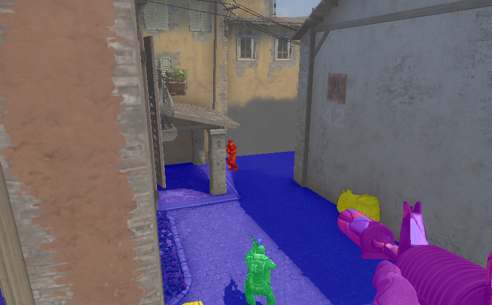

# CS:GO Labels
> Dataset of gameplay screenshots and corresponding labels for training segnets

Learn more from [the blog post](https://selfplaylabs.com/blog/csgo-labels), or on the [Selfplay Labs Discord](http://selfplaylabs.com/discord) in the #csgo-labels channel.

## Directories

<pre>
 imgs/  -- The PNG image files
 masks/ -- PNG segmentation masks (update these!)
 tools/ -- Various scripts for manipulating the dataset
</pre>

## Segmentation classes

<pre>
 1 - #0000FF - walkable (everywhere you can walk on, including surfaces of boxes you have to jump on)
 2 - #7A7A7A - unwalkable (walls, ceiling, sky)
 3 - #FFFF00 - jump/climb (boxes, ladders, skill jumps)
 4 - #cc00ff - first person (player model (arm,hand) and equipped gun/gear. don't include muzzle flashes or cartridges)
 5 - #00ff66 - ct player model (excl. shadows)
 6 - #ff0000 - t player model (excl. shadows)
 6 - TBD - nades in action (flying nades, smoke from smoke grenade, fire from molotov, explosion from he
 6 - TBD - dropped gear (gear laying on the ground, weapons, defuse kit, bomb)
</pre>

## How can I help?

1. Visit the [Google Spreadsheet](https://docs.google.com/spreadsheets/d/1F_AhRoapqCk8A7S-d9hqNMssbh6DgShdeD8cixknh2E/edit?usp=sharing) (request access to edit the spreadsheet) and put your discord username in the "labeler" column for the mask(s) you'll be working on and change the status to "In Progress." If you're new, please start off with just one so we can leave you feedback; this is to prevent you from having to redo them because of something done incorrectly.

2. Spend some time studying already merged masks to see how things are labeled.
4. Start labelling! Useful label tools:
   * [csgo-labeler](https://label.selfplaylabs.com) (Only compatible with Chrome and Edge. Other browsers like Brave, Firefox, and Opera, even if chromium based, don't work properly. Must also be used with browser zoom and monitor scaling disabled.)

   * An external image manipulation tool such as [GIMP](https://www.gimp.org/downloads/)/[Krita](https://krita.org/) (Free) or [Adobe Photoshop](https://www.adobe.com/products/photoshop.html) (Paid).
If you choose to use an external tool please ensure your color mode is set to 8-bit, and that antialiasing doesn't change the colors on the edges of your mask.

5. Fork this repository to your account using the "Fork" button in the top right
6. Create a **new branch** from the **main** branch, and use your labelling tool of choice to label some images
7. Open a pull request from your new branch to the main branch in the official repository to submit your changes!
8. Visit the #csgo-labels channel on the [Selfplay Labs Discord](http://selfplaylabs.com/discord) for the latest news and chat about the project.

